## ALGORITHMS

# About

Sorting - The process of ordering a set of objects according to some attribute.
Algorithm - In mathematics and computer science, an algorithm is a finite sequence of well-defined instructions, typically used to solve a class of specific problems or to perform a computation.

# Basics

wikipedia: https://en.wikipedia.org/wiki/Algorithm<br />

# Linear Search

In computer science, a linear search or sequential search is a method for finding an element within a list. It sequentially checks each element of the list until a match is found or the whole list has been searched<br />

Wikipedia: https://en.wikipedia.org/wiki/Linear_search<br />

Best Time Complexity: O(n)
Worst Time Complexity: O(n^2)<br />

<p style="text-align: center"></p><br />

# Binary search

In computer science, binary search, also known as half-interval search, logarithmic search, or binary chop, is a search algorithm that finds the position of a target value within a sorted array. Binary search compares the target value to the middle element of the array.<br />

Wikipedia: https://en.wikipedia.org/wiki/Binary_search_algorithm<br />

<p style="text-align: center">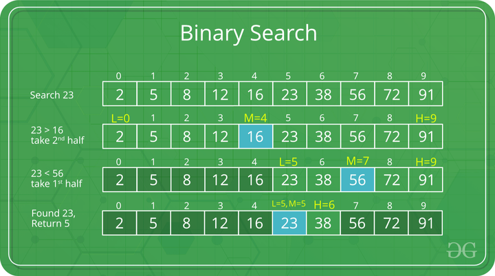</p><br />

# Selection Sort

In computer science, selection sort is an in-place comparison sorting algorithm. It has an O(n2) time complexity, which makes it inefficient on large lists, and generally performs worse than the similar insertion sort.<br />

Wikipedia: https://en.wikipedia.org/wiki/Selection_sort<br />

<p style="text-align: center">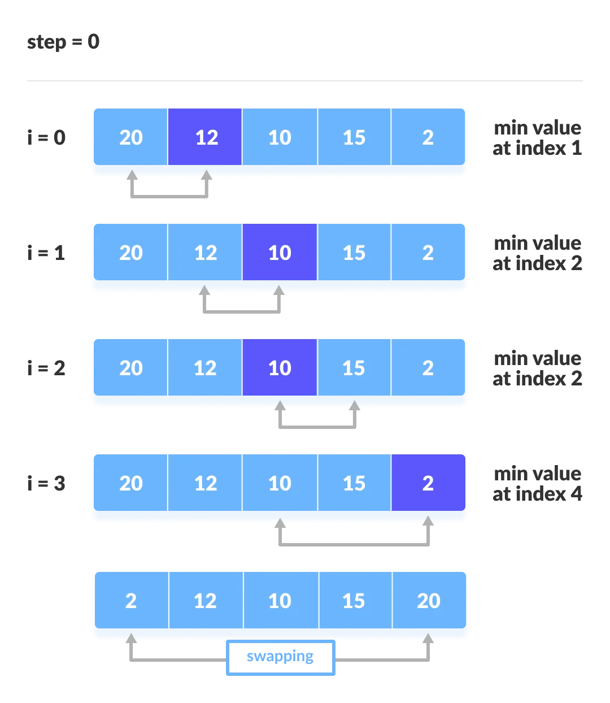</p><br />

# Quicksort

Quicksort is an in-place sorting algorithm. Developed by British computer scientist Tony Hoare in 1959 and published in 1961, it is still a commonly used algorithm for sorting. When implemented well, it can be somewhat faster than merge sort and about two or three times faster than heapsort.<br />

Wikipedia: https://en.wikipedia.org/wiki/Quicksort<br />

<p style="text-align: center">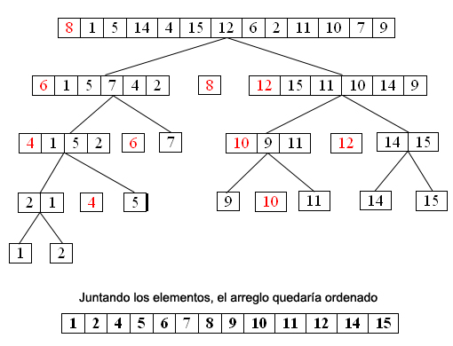</p><br />

# Bubble Sort

Bubble sort, sometimes referred to as sinking sort, is a simple sorting algorithm that repeatedly steps through the list, compares adjacent elements and swaps them if they are in the wrong order.<br />

Wikipedia: https://en.wikipedia.org/wiki/Bubble_sort<br />

<p style="text-align: center">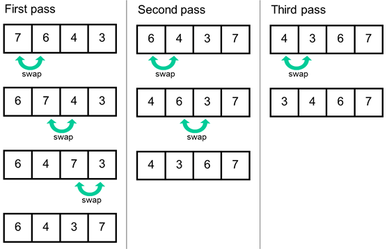</p><br />

# Merge Sort

In computer science, merge sort (also commonly spelled as mergesort) is an efficient, general-purpose, and comparison-based sorting algorithm. Most implementations produce a stable sort, which means that the order of equal elements is the same in the input and output. Merge sort is a divide-and-conquer algorithm that was invented by John von Neumann in 1945. A detailed description and analysis of bottom-up merge sort appeared in a report by Goldstine and von Neumann as early as 1948.<br />

Best Time Complexity: O(n \* log n)
Worst Time Complexity: O(n^2)<br />

Wikipedia: https://en.wikipedia.org/wiki/Merge_sort<br />

<p style="text-align: center">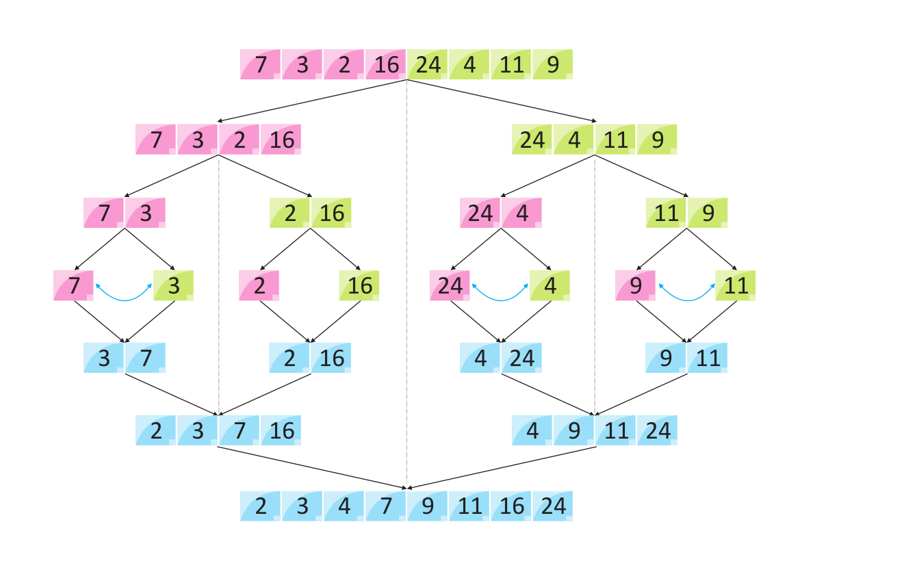</p><br />

# Shellsort

Shellsort, also known as Shell sort or Shell's method, is an in-place comparison sort. It can be seen as either a generalization of sorting by exchange (bubble sort) or sorting by insertion (insertion sort). The method starts by sorting pairs of elements far apart from each other, then progressively reducing the gap between elements to be compared. By starting with far apart elements, it can move some out-of-place elements into position faster than a simple nearest neighbor exchange<br />

Wikipedia: https://en.wikipedia.org/wiki/Shellsort<br />

<p style="text-align: center"></p><br />

# Heap Sort

In computer science, heapsort is a comparison-based sorting algorithm. Heapsort can be thought of as an improved selection sort: like selection sort, heapsort divides its input into a sorted and an unsorted region, and it iteratively shrinks the unsorted region by extracting the largest element from it and inserting it into the sorted region.<br />

Wikipedia: https://en.wikipedia.org/wiki/Heapsort<br />

<p style="text-align: center">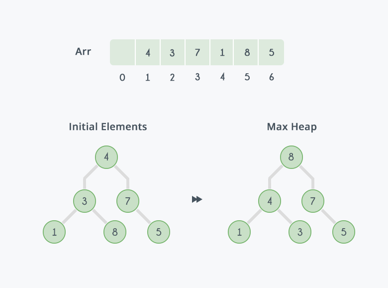</p><br />

# Smooth Sort

In computer science, smoothsort is a comparison-based sorting algorithm. A variant of heapsort, it was invented and published by Edsger Dijkstra in 1981. Like heapsort, smoothsort is an in-place algorithm with an upper bound of O(n log n), but it is not a stable sort.<br />

Wikipedia: https://en.wikipedia.org/wiki/Smoothsort<br />

<p style="text-align: center">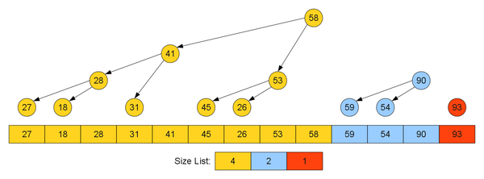</p><br />

# Patience Sort

In computer science, patience sorting is a sorting algorithm inspired by, and named after, the card game patience. A variant of the algorithm efficiently computes the length of a longest increasing subsequence in a given array.<br />

Wikipedia: https://en.wikipedia.org/wiki/Patience_sorting<br />

<p style="text-align: center">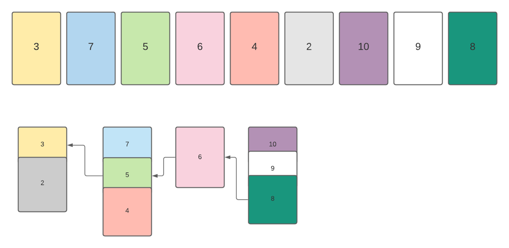</p><br />

# Radix Sort

In computer science, radix sort is a non-comparative sorting algorithm. It avoids comparison by creating and distributing elements into buckets according to their radix. For elements with more than one significant digit, this bucketing process is repeated for each digit, while preserving the ordering of the prior step, until all digits have been considered.<br />

Wikipedia: https://en.wikipedia.org/wiki/Radix_sort<br />

<p style="text-align: center">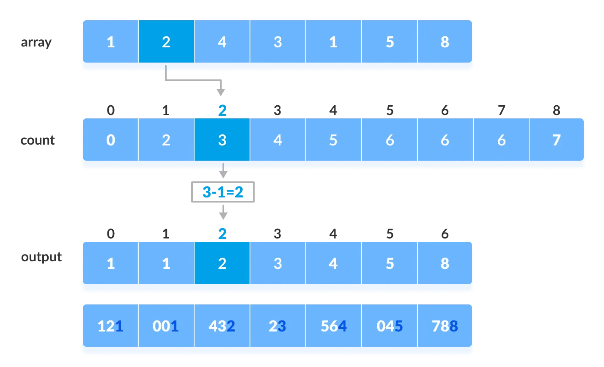</p><br />

# Counting Sort

Counting sort is a sorting technique based on keys between a specific range. It works by counting the number of objects having distinct key values (kind of hashing). Then do some arithmetic to calculate the position of each object in the output sequence.Counting sort makes assumptions about the data, for example, it assumes that values are going to be in the range of 0 to 10 or 10 – 99 etc, Some other assumptions counting sort makes are input data will be all real numbers.<br />

Wikipedia: https://en.wikipedia.org/wiki/Counting_sort<br />

<p style="text-align: center"></p><br />

# Recursive Traversal Binary Tree

In computer science, tree traversal (also known as tree search and walking the tree) is a form of graph traversal and refers to the process of visiting (e.g. retrieving, updating, or deleting) each node in a tree data structure, exactly once. Such traversals are classified by the order in which the nodes are visited. The following algorithms are described for a binary tree, but they may be generalized to other trees as well.<br />

Wikipedia: https://en.wikipedia.org/wiki/Tree_traversal<br />

<p style="text-align: center">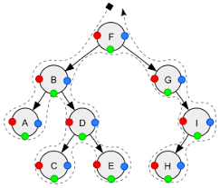</p><br />

# Dijkstra's Algorithm

Dijkstra's algorithm is an algorithm for finding the shortest paths between nodes in a graph, which may represent, for example, road networks. It was conceived by computer scientist Edsger W. Dijkstra in 1956 and published three years later.
The algorithm exists in many variants. Dijkstra's original algorithm found the shortest path between two given nodes, but a more common variant fixes a single node as the "source" node and finds shortest paths from the source to all other nodes in the graph, producing a shortest-path tree.<br />

Wikipedia: https://en.wikipedia.org/wiki/Dijkstra%27s_algorithm<br />

<p style="text-align: center"></p><br />

# Diffie Hellman Key Exchange

Diffie–Hellman key exchange[nb 1] is a method of securely exchanging cryptographic keys over a public channel and was one of the first public-key protocols as conceived by Ralph Merkle and named after Whitfield Diffie and Martin Hellman. DH is one of the earliest practical examples of public key exchange implemented within the field of cryptography. Published in 1976 by Diffie and Hellman, this is the earliest publicly known work that proposed the idea of a private key and a corresponding public key.<br />

Wikipedia: https://en.wikipedia.org/wiki/Diffie–Hellman_key_exchange<br />

<p style="text-align: center">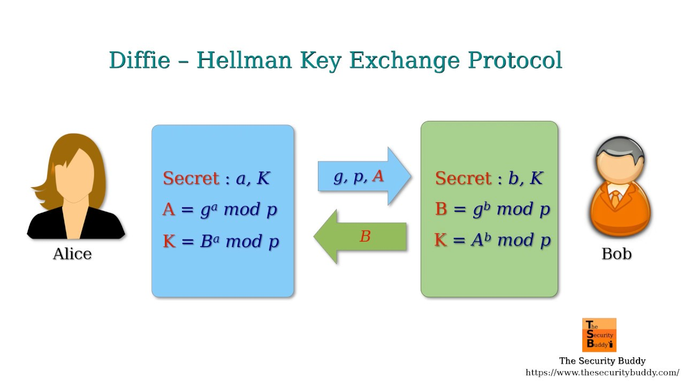</p><br />

# Fourier Transform

A Fourier transform (FT) is a mathematical transform that decomposes functions depending on space or time into functions depending on spatial frequency or temporal frequency. An example application would be decomposing the waveform of a musical chord into terms of the intensity of its constituent pitches. The term Fourier transform refers to both the frequency domain representation and the mathematical operation that associates the frequency domain representation to a function of space or time.The Fourier transform of a function is a complex-valued function representing the complex sinusoids that constitute the original function. For each frequency, the magnitude (absolute value) of the complex value represents the amplitude of a constituent complex sinusoid with that frequency, and the argument of the complex value represents that complex sinusoid's phase offset. If a frequency is not present, the transform has a value of 0 for that frequency.<br />

Wikipedia: https://en.wikipedia.org/wiki/Fourier_transform<br />

<p style="text-align: center">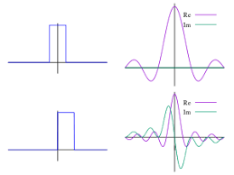</p><br />

# Hyper Log Log

HyperLogLog is an algorithm for the count-distinct problem, approximating the number of distinct elements in a multiset. Calculating the exact cardinality of a multiset requires an amount of memory proportional to the cardinality, which is impractical for very large data sets. Probabilistic cardinality estimators, such as the HyperLogLog algorithm, use significantly less memory than this, at the cost of obtaining only an approximation of the cardinality. The HyperLogLog algorithm is able to estimate cardinalities of > 109 with a typical accuracy (standard error) of 2%, using 1.5 kB of memory. HyperLogLog is an extension of the earlier LogLog algorithm, itself deriving from the 1984 Flajolet–Martin algorithm.<br />

Wikipedia: https://en.wikipedia.org/wiki/HyperLogLog<br />

<p style="text-align: center">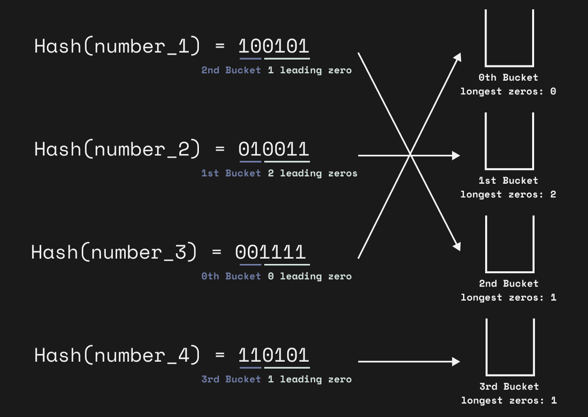</p><br />

# Hash Function

A hash function is any function that can be used to map data of arbitrary size to fixed-size values. The values returned by a hash function are called hash values, hash codes, digests, or simply hashes. The values are usually used to index a fixed-size table called a hash table. Use of a hash function to index a hash table is called hashing or scatter storage addressing. Hash functions and their associated hash tables are used in data storage and retrieval applications to access data in a small and nearly constant time per retrieval. They require an amount of storage space only fractionally greater than the total space required for the data or records themselves<br />

Wikipedia: https://en.wikipedia.org/wiki/Hash_function<br />

<p style="text-align: center"></p><br />

# Fibonacci

In mathematics, the Fibonacci numbers, commonly denoted Fn, form a sequence, the Fibonacci sequence, in which each number is the sum of the two preceding ones. The sequence commonly starts from 0 and 1, although some authors omit the initial terms and start the sequence from 1 and 1 or from 1 and 2. Starting from 0 and 1, the next few values in the sequence are: 0, 1, 1, 2, 3, 5, 8, 13, 21, 34, 55, 89, 144<br />

Wikipedia: https://en.wikipedia.org/wiki/Fibonacci_number <br />

```ts
// Formula: Fn = F(n - 1) + F(n + 2)
```

# Bucket Sorting

Bucket sort is a sorting algorithm in which the sorted elements are distributed among a finite number of separate blocks so that all elements in each next block in order are always larger than in the previous one. Each block is then sorted separately, either recursively by the same method or by another.<br />

Wikipedia: https://en.wikipedia.org/wiki/Bucket_sort <br />

<p style="text-align: center"></p>

# Insertion Sorting

A sorting algorithm in which the elements of the input sequence are examined one at a time, and each new incoming element is placed in a suitable place among the previously sorted elements.<br />

Wikipedia: https://en.wikipedia.org/wiki/Insertion_sort <br />

<p style="text-align: center"></p>

# Cycle Sorting

Round-robin sort is an unstable in-place sorting algorithm, a comparison sort that is theoretically optimal in terms of the total number of entries in the original array, unlike any other in-place sorting algorithm<br />

Wikipedia: https://en.wikipedia.org/wiki/Cycle_sort<br />

<p style="text-align: center">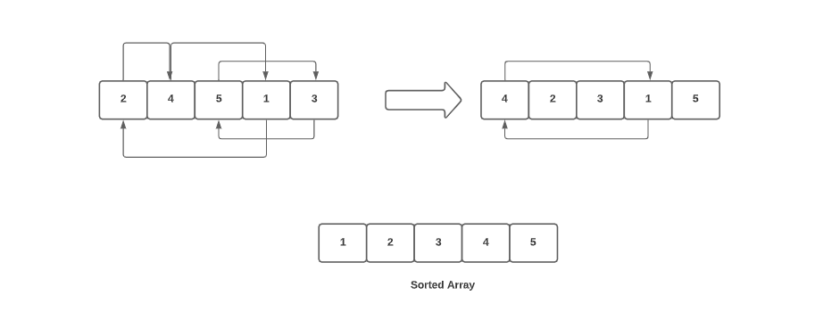</p>

# Bredth-First Search

# Depth-First Search
