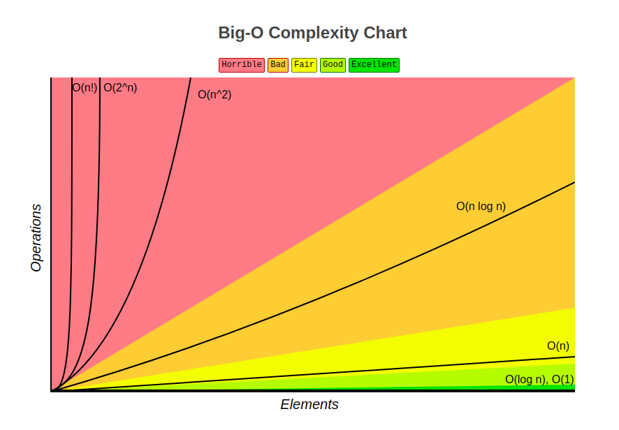

## BIG-O-NOTATION

# About

Big O notation[O(n) like an example] - it's a mathematical notation that describes the limiting behavior of a function when the argument tends towards a particular value or infinity. Big O is a member of a family of notations invented by Paul Bachmann, Edmund Landau, and others, collectively called Bachmann–Landau notation or asymptotic notation. The letter O was chosen by Bachmann to stand for Ordnung, meaning the order of approximation.
In computer science, big O notation is used to classify algorithms according to how their run time or space requirements grow as the input size grows. In analytic number theory, big O notation is often used to express a bound on the difference between an arithmetical function and a better understood approximation; a famous example of such a difference is the remainder term in the prime number theorem. Big O notation is also used in many other fields to provide similar estimates.
Big O notation characterizes functions according to their growth rates: different functions with the same growth rate may be represented using the same O notation. The letter O is used because the growth rate of a function is also referred to as the order of the function. A description of a function in terms of big O notation usually only provides an upper bound on the growth rate of the function.

# How to count ?

Everything is very simple - if you see that in one of the options the smallest value, then this is the "best" case, and if vice versa - the "worst"

# Basics

Wikipedia - https://en.wikipedia.org/wiki/Big_O_notation<br />
Time complexity - https://en.wikipedia.org/wiki/Time_complexity

# O(n) - Linear time

```ts
//O(5) = 5
```

# O(n^2) - Quadratic time

```ts
//O(5^2) = 25
```

# O(log n) - Logarithmic time

```ts
//O(log)
```

# O(n log n) - Linearithmic time

```ts
//O(5 log 5) = 3.49
```

# O(2^n) - Exponential time

```ts
//O(2^5) = 32
```

# O(n!) - Factorial time

```ts
//O(5!) = 120
```

# Table of BigONotation

<p style="text-align: center"></p>
