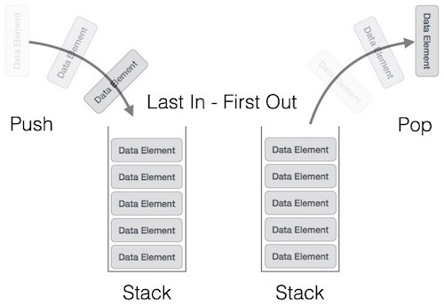
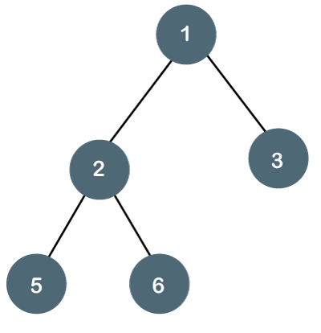

## DATA-STRUCTURES

# About

Data structure - is a data organization, management, and storage format that enables efficient access and modification. More precisely, a data structure is a collection of data values, the relationships among them, and the functions or operations that can be applied to the data,

# Basics

Wikipedia - https://en.wikipedia.org/wiki/Data_structure 

# Stack

Stacks are known as LIFO (Last In First Out) structures. This means the element placed last can be accessed first. You can “push” a new element onto the top of the stack, or you can “pop,” deleting the element inserted last which is at the top of the stack. 

Wikipedia: https://en.wikipedia.org/wiki/Stack 

# Queue

A queue functions similarly to a stack, but instead of being a LIFO structure, it is a FIFO (First In First Out) structure. The easiest way to think about a queue is to think of a line of people waiting to enter a building. The person at the beginning of the line will enter the building first, while the person at the end will enter last.

You can enqueue an element in this structure, which means inserting the element to the end of the queue. You can also dequeue an element, which means deleting an element from the beginning of the queue.

Queues are often used to manage threads in multithreading, and they are (not surprisingly) used to implement priority queuing systems. 

Wikipedia: https://en.wikipedia.org/wiki/Queue_(abstract_data_type) 

# Hash-Table

A hash table structure associates each value with a key and then stores them. This makes it easy to look up values efficiently using a key. It’s an efficient way to insert and search for data regardless of its size, as it makes it easy to identify a specific object from a group of similar objects.

For example, if you go to college, you may be assigned a unique student ID number. This ID number is a key that can be used to retrieve information about you and your student record.

A hash table uses what’s known as a “hash function” to map a data set of any size to one of a fixed size—the hash table. The values that a hash function returns are known as “hash values.”

Hash tables are commonly used to create database indexes, to create associative arrays and to create a “set.” 

Wikipedia: https://en.wikipedia.org/wiki/Hash_table 

# Array

One of the simplest data structures, an array is a collection of items that are stored sequentially. An array contains values or variables—known as “elements”—of the same data type and is of a fixed size, so you cannot change the size of an array. Each item in an array is indexed starting with 0.

The best way to think about an array is like a weekly medication organizer. It includes small containers lined up in a sequence, and each container has elements inside.

Arrays are commonly used as structures for building other, more complicated data structures. They are also used for sorting algorithms. 

Wikipedia: https://en.wikipedia.org/wiki/Array 

# Linked List

A linked list is a sequence of items arranged in a linear order all connected to each other. This means you must access data in order, so random access to data is not possible.

Each element in a linked list is called a “node,” and each node contains a key and a pointer. The pointer directs you to the next node, called a “next.” The sequence starts with a “head,” which directs you to the first element within the list. The last element of this list is known as the “tail.” 

Wikipedia: https://en.wikipedia.org/wiki/Linked_list#:~:text=In%20computer%20science%2C%20a%20linked,which%20together%20represent%20a%20sequence. 

# Heap

Similarly, a heap is a type of binary tree in which the parent nodes are compared to their children. This allows the values within the nodes to be arranged accordingly. Heaps can be represented as trees, but they can also be represented as binary arrays.

There are two types of heaps. In a min heap, the parent’s key is less than or equal to the keys of its children. In a max heap, the parent’s key is greater than or equal to the keys of its children.

Heaps are often used in algorithms to create priority queues, and to find the smallest or largest value in an array. 

Wikipedia: https://en.wikipedia.org/wiki/Heap_(data_structure) 

# Tree

A tree is a structure similar to a linked list because each item is linked. But in a tree items are linked in a hierarchal fashion, just like you might see in a visual representation of someone’s family tree. There are various types of trees, each suited to different applications.

For example, a binary search tree (BST) stores data in sorted order with every node in the binary comprised of the following attributes:

Key (the value saved in the node)
Left (pointer to the left child node)
Right (pointer to the right child node)
P (pointer to the parent node)
Binary search trees are used in many different types of search applications. Other types of trees are used in wireless networking and to create expression solvers. 

Wikipedia: https://en.wikipedia.org/wiki/Tree_(data_structure) 

 

# Red Black Tree

In computer science, a red–black tree is a kind of self-balancing binary search tree. Each node stores an extra bit representing "color" ("red" or "black"), used to ensure that the tree remains balanced during insertions and deletions. 

Wikipedia: https://en.wikipedia.org/wiki/Red–black_tree 

# Splay Tree

A splay tree is a binary search tree with the additional property that recently accessed elements are quick to access again. Like self-balancing binary search trees, a splay tree performs basic operations such as insertion, look-up and removal in O(log n) amortized time

Wikipedia: https://en.wikipedia.org/wiki/Splay_tree 

 

# Graph

A graph is an abstract, non-linear data structure that is made of a finite set of nodes that are connected by edges. The nodes may be referred to as “vertices” and contain values, whereas the edges are simply lines or arcs that connect two nodes in the graph.Graphs are often used to represent networks, such as circuit networks or even paths in a city. They're great for solving real-world problems, but they can also be used as representations of digital networks.
For example, on Facebook, each user could be represented with a node (or vertex). Each vertex could then contain information about that user, and each edge could represent their connection with another user. 

Wikipedia: https://en.wikipedia.org/wiki/Graph_(abstract_data_type) 

 

# Bloom Filter

A Bloom filter is a space-efficient probabilistic data structure, conceived by Burton Howard Bloom in 1970, that is used to test whether an element is a member of a set. False positive matches are possible, but false negatives are not – in other words, a query returns either "possibly in set" or "definitely not in set". Elements can be added to the set, but not removed (though this can be addressed with the counting Bloom filter variant); the more items added, the larger the probability of false positives. 

Wikipedia: https://en.wikipedia.org/wiki/Bloom_filter 

 

# Priority Queue

Priority Queue is an extension of Queue having some properties as follows:

- Each element of the priority queue has a priority associated with it.
- Elements are added to the queue as per the priority.
- Lowest priority elements are removed first.

We can design a priority queue using two approaches in the first case we can add the queue element at the end of the queue and we can remove the elements of the queue depending on the priority. In the second case, we can add elements to the queue according to the priority and remove them from the front of the queue. In this article, we would use the second approach to implement a Priority Queue. 

Wikipedia: https://en.wikipedia.org/wiki/Priority_queue 

